# GPU-ATLAS-HeteroSim

GPU-ATLAS-HeteroSim 是面向 GPU、ATLAS Compute Die 与 3D-DRAM 的异构端到端 LLM 联合仿真工程。工程把完整 Prefill/Decode 请求图、算子放置、跨设备数据移动、Paged KV Cache 和全局事件调度连接到同一条可复现运行路径。

> 当前版本为 `0.42.0`。工程已经形成 GPU、ATLAS、系统级 NoC 与共享 3D-DRAM 的功能及请求周期闭环，并接入 Hugging Face、vLLM 和 TensorRT-LLM 的框架事件。当前所有性能声明保持关闭：确定性双遍、请求守恒和零在途证明实现可复现，但不等价于实体硬件性能已经校准。

长时间资格验证可以部署到`192.168.5.2`并把两个确定性 Leg 绑定到不同 CPU 并行执行；密码不进入仓库或日志。远端路径、执行约定、单轮入口和结果合并方法见[远端验证规范](docs/REMOTE_VALIDATION.md)。

完整架构约束以[GPU + ATLAS异构端到端仿真实现规范](docs/gpu_atlas_heterogeneous_simulation_design_zh.md)为准，详细版本历史和机器证据见[实现状态](docs/IMPLEMENTATION_STATUS.md)，复现实验见[手工复现手册](REPRODUCTION_MANUAL_zh.md)。

## 整体仿真架构

```mermaid
flowchart LR
    RT["异构运行时 / 全局时间线<br/>ModelGraph → Placement → ExecutionGraphIR<br/>统一Global PA、依赖、版本与资源调度"]

    subgraph GPU["GPU仿真路径｜NVBit + Accel-Sim / GPGPU-Sim"]
        TRACE["真实执行程序<br/>SASS指令与访存Trace"]
        SM["SM Array<br/>Warp / LSU / Tensor Core"]
        GCACHE["Register / Shared Memory / L1"]
        GINOC["GPU内部NoC<br/>Core ↔ Memory Partition"]
        L2["L2 Cache / Memory Partition"]
        GPORT["External Memory Port<br/>导出LLC Miss<br/>支持Stall / Resume"]

        TRACE --> SM --> GCACHE --> GINOC --> L2 --> GPORT
    end

    subgraph PIM["DRAM-PIM计算路径｜ATLAS Compiler + atlasim.Chip"]
        TIR["Tensor IR<br/>算子Shape与数据布局"]
        PLAN["Tiling / Placement<br/>Stage / Tile计划"]
        CHIP["16个Logic Core"]
        CORE["每核：Controller<br/>Matrix + Vector + Local Buffer"]
        HB["Internal Hybrid-Bond / TSV Port"]

        TIR --> PLAN --> CHIP --> CORE --> HB
    end

    subgraph NOC["系统级NoC｜ATLAS-patched BookSim2 2×2 Mesh"]
        NGPU(("gpu0"))
        NPIM(("atlas0.compute"))
        GW["gateway0<br/>QoS仲裁与Packet转发"]
        NDRAM(("dram0"))

        NGPU -->|"请求Packet"| GW
        NPIM -->|"请求Packet"| GW
        GW -->|"Flit / Credit"| NDRAM
        NDRAM -.->|"完成响应"| GW
        GW -.->|"Resume"| NGPU
        GW -.->|"完成通知"| NPIM
    end

    subgraph DRAM["共享3D-DRAM｜唯一时序所有者"]
        MABI["Memory-side Gateway ABI<br/>接收Global PA Parent"]
        MEMSVC["Shared3DMemoryService<br/>Parent拆分 / Child合并"]
        RAM["唯一Ramulator2实例<br/>Controller + Scheduler"]
        MAP["地址映射<br/>OneLevelInterleave"]
        STACK["3D-DRAM Stack<br/>Channel / Bank Group / Bank<br/>Row / Column"]

        MABI --> MEMSVC --> RAM --> MAP --> STACK
        STACK -.->|"Child durable completion"| MEMSVC
    end

    RT -->|"GPU算子派发"| TRACE
    RT -->|"PIM算子Lowering"| TIR
    GPORT -->|"Global PA Parent Request"| NGPU
    HB -->|"Global PA Parent Request"| NPIM
    NDRAM -->|"进入内存后端"| MABI
    MEMSVC -.->|"Parent completion"| NDRAM
```



GPU内部NoC由Accel-Sim/GPGPU-Sim负责，连接SM、Cache和Memory Partition；系统级NoC由ATLAS补丁版BookSim2实现，连接`gpu0`、`atlas0.compute`、`gateway0`和`dram0`。GPU与ATLAS最终共享一个`Shared3DMemoryService`和唯一Ramulator2时序实例。图中实线表示请求或派发路径，虚线表示durable completion和恢复路径。

## 1. 项目状态

### 1.1 已实现功能

- **统一异构运行时**：支持Decoder-only LLM的Prefill、逐Token Decode、多Token和多Batch计算图；可以按算子和Shape选择GPU或ATLAS，并在统一飞秒时间线上审计依赖、资源占用、Tensor版本和请求完成。
- **地址与生命周期管理**：实现Global PA、Paged KV、Residency、跨设备Copy/Migration/Remote/Fence、KV容量Admission/Retire、释放后地址复用以及Parent/Child/durable守恒检查。
- **GPU执行路径**：支持真实执行程序的NVBit SASS/访存Trace捕获、执行身份封存、Range-Rebase、精确Shape Artifact以及Accel-Sim/GPGPU-Sim周期回放；固定TinyLlama配置下14类GPU算子均已完成请求周期双遍验证。
- **ATLAS/PIM执行路径**：支持Tensor IR到Tiling、Placement、Stage/Tile和16个Logic Core计划的Lowering，可生成绑定Global PA的完整内存请求流并通过独立双遍Ramulator2周期回放。
- **NoC与共享内存路径**：ATLAS补丁版BookSim2已经提供4节点2×2 Mesh的逐周期Packet/Flit/Credit数据面；GPU和ATLAS请求经过Gateway进入唯一Ramulator2实例，共享Controller、Channel和Bank，并在完成时返回发起方。
- **请求调度与可靠性**：实现Static/Continuous Batch、Homogeneous/Padding/Ragged Split、EOS、最大生成长度、显式取消、QoS、加权公平、饥饿上界以及Deadlock/Livelock Watchdog。
- **推理框架接入**：真实Hugging Face请求可以生成稳定Manifest和GPU/ATLAS Artifact；vLLM Scheduler/Paged-KV事件与TensorRT-LLM LLM/Profile/Scheduler事件已经可以观测并加入不反馈修改框架数值结果的Shadow路径。
- **可复现证据**：关键运行记录Simulation Key、依赖版本、内容哈希、地址绑定、请求计数、完成摘要和性能门禁；GPU整层与ATLAS QKV请求流均已有确定性双遍证据。

### 1.2 待实现功能

- 完成GPU算子性能校准：当前14类算子只有4类进入RTX 3070 Native误差±15%门槛，其余算子需要分解Kernel选择、Launch/同步、频率、Cache和DRAM差异。
- 为Copy Engine、Runtime Control、GPU外部Link、Logic-Die Gateway和3D-DRAM建立独立硬件或可信参考模拟器校准点，并重新执行整机性能门禁。
- 把GPU整层Artifact拆成可替换的算子级片段，在同一实例中实现真正的GPU/ATLAS混合放置；当前GPU整层包络已包含QKV，不能与ATLAS QKV候选周期直接相加。
- 为不同Batch、Context、KV Length和Ragged组合生成真实Batched/Fused GPU与ATLAS Artifact，覆盖长序列、多Token和长期共享内存竞争。
- 将真实vLLM调度器和TensorRT-LLM Engine事件直接绑定到Artifact选择、地址分配和周期仿真；补充序列化TensorRT Engine、Tactic、Plugin和CUDA Graph路径。
- 将BookSim2从固定4节点资格用例扩展到完整ATLAS Chip内部网络和长时间GPU/PIM/DRAM联合运行，并校准Router、Buffer、Link和时钟参数。
- 补充ATLAS/PIM计算单元的硬件或RTL性能基线，以及功耗、能耗和面积模型。
- 按研究需要实现MMU/TLB、UVM/CXL共享页和可配置/XOR DRAM地址映射；当前这些能力不在已验证范围内。

### 1.3 当前架构设计问题

- **地址映射不一致**：共享DRAM当前使用`OneLevelInterleave`，而Accel-Sim RTX 3070配置使用原生IPOLY/Partition索引；两者还包含不同Controller和Bank状态机，使投影类算子的Ramulator2结果出现显著偏差。
- **时序所有权容易重复**：GPU内部DRAM延迟、外部Link、BookSim2、Logic-Die Gateway和Ramulator2必须严格分层。任一路径重复计时都会把同一次访存延迟计算两次，因此共享3D-DRAM只能有一个Ramulator2时序所有者。
- **Artifact粒度不对称**：GPU侧既有逐算子Trace，也有包含QKV的整层40-Kernel包络；ATLAS侧当前主要是QKV候选。两者只有完成算子替换和依赖重构后才能形成合法的混合放置makespan。
- **Trace回放存在语义边界**：固定SASS Trace适合确定性请求回放，但无法自动反映由内存时序引起的控制流、原子竞争、Spinlock或同步顺序变化；此类工作负载需要执行驱动或请求耦合模型。
- **Global PA不等于虚拟内存模型**：当前路径能够完成Trace地址Range-Rebase和DRAM Tuple译码，但没有模拟MMU、TLB和Page Walk；不能把地址重绑定描述为完整VA→PA时序。
- **一致性依赖软件协议**：GPU和ATLAS共享3D-DRAM采用显式非一致模型，设备切换依赖Writeback、Invalidate和Fence；尚未实现硬件Cache Coherence。
- **多时钟域尚未完成实体校准**：GPU、NoC、Gateway、PIM和DRAM由统一飞秒时间线协调，但频率、队列、带宽和固定延迟仍缺少目标硬件参考。
- **框架事件与硬件执行尚未完全闭环**：当前vLLM和TensorRT-LLM接入主要验证事件语义与Shadow绑定，尚未让真实框架调度直接驱动统一GPU/PIM硬件时间线。
- **功能正确性与性能真实性仍有差距**：确定性双遍、请求守恒和零在途已经广泛通过，但当前性能门禁仍为`performance_claim_allowed=false`。

### 1.4 当前14类GPU算子测试结果

固定测试合同为TinyLlama-1.1B、Layer 0、FP16、BS=1、Context=16和RTX 3070/SM86。Native列来自50次Warmup加500次CUDA Event测量；Accel-Sim列使用匹配执行身份与`gpu_local_vram`拓扑的双遍结果。偏差定义为`(仿真时间 - Native时间) / Native时间`，正值表示仿真更慢，负值表示仿真更快；当前算子级门槛为绝对偏差不超过15%。

| 算子 | 主要功能 | RTX 3070 Native/µs | Accel-Sim/µs | Accel-Sim对Native偏差 | 校准状态 | Ramulator2-GDDR6/µs | Ramulator2对Native偏差 |
|---|---|---:|---:|---:|---|---:|---:|
| Token Embedding | Token ID转换为隐藏向量 | 10.464 | 6.402 | -38.82% | 超阈值 | 6.378 | -39.05% |
| Attention Norm | Attention前RMSNorm | 100.992 | 51.887 | -48.62% | 超阈值 | 51.554 | -48.95% |
| QKV Projection | 生成Query、Key和Value | 77.440 | 84.056 | +8.54% | 通过 | 190.690 | +146.24% |
| RoPE | 对Q/K施加旋转位置编码 | 297.056 | 112.274 | -62.20% | 超阈值 | 112.577 | -62.10% |
| Causal Attention | 执行带因果Mask的Attention | 21.504 | 30.851 | +43.46% | 超阈值 | 31.332 | +45.70% |
| Output Projection | Attention结果线性投影 | 36.864 | 42.234 | +14.57% | 通过，接近边界 | 154.297 | +318.56% |
| Residual Add | Attention/MLP输出与残差相加 | 22.752 | 5.466 | -75.97% | 超阈值 | 6.331 | -72.17% |
| MLP Norm | MLP前RMSNorm | 168.224 | 51.887 | -69.16% | 超阈值 | 51.554 | -69.35% |
| Gate/Up Projection | MLP门控和升维投影 | 206.848 | 162.030 | -21.67% | 超阈值 | 679.811 | +228.65% |
| SiLU Multiply | SiLU激活与门控相乘 | 107.520 | 11.799 | -89.03% | 超阈值 | 14.198 | -86.80% |
| Down Projection | MLP结果降维投影 | 96.256 | 91.808 | -4.62% | 通过 | 229.102 | +138.01% |
| Final Norm | 输出前最终RMSNorm | 374.784 | 44.147 | -88.22% | 超阈值 | 44.193 | -88.21% |
| LM Head | 隐藏向量映射到词表Logits | 351.232 | 337.898 | -3.80% | 通过 | 1246.103 | +254.78% |
| Sampling | 根据Logits选择下一个Token | 60.416 | 17.673 | -70.75% | 超阈值 | 17.975 | -70.25% |

当前Accel-Sim本地显存模型为4/14通过、10/14超阈值，平均绝对相对误差为45.67%，中位绝对误差为46.04%。通过门槛的是Down Projection、LM Head、QKV Projection和Output Projection，其中Output Projection距离15%边界较近，四项均仍需稳定性复核。

Ramulator2-GDDR6列来自32 B事务粒度、4 GiB容量和约448 GB/s峰值带宽的诊断对照。Ramulator2相对Accel-Sim内部GDDR6有7/14落入15%以内，但相对Native为0/14，平均绝对相对误差为119.20%。该实验替换了DRAM Controller、Scheduler、状态机和地址映射器，并使用近零开销GPU到内存适配器，不代表完整外部Link、Logic Die和3D-DRAM端到端性能。详细数据见[GPU算子误差分解](docs/qualification/p18_gpu_operator_error_triage.md)和[GDDR6模型对比](validation/gddr6_model_comparison_32b_parity/README.md)。

## 2. 目录结构

```text
GPU-ATLAS-HeteroSim/
├── configs/hetero/              # 模型、工作负载、放置、地址和实验配置
├── docs/                         # 冻结设计规范、构建记录和实现状态
├── frontend/hetero/              # Python 配置、ModelGraph、Placement、Runner
├── scripts/                      # Accel-Sim 安装、构建、CUDA 工作负载和 Trace 采集
├── simulator/                    # C++ 运行时、内存服务、pybind11 与单元测试
├── tests/hetero/                 # Python 端到端及配置回归测试
├── workloads/cuda/               # 最小可验证 CUDA 工作负载
├── dependency_lock.yaml          # 外部依赖版本记录
└── runs/                         # 本地运行产物，默认不提交 Git
```

## 3. 推荐环境

已经验证的参考环境：Windows 11 + WSL2、Ubuntu 22.04、Python 3.10、CMake 3.22、GCC/G++ 11 和 Ubuntu `pybind11-dev` 2.9.1。

本文假定 WSL 工程路径为：

```text
/opt/gpu-atlas/GPU-ATLAS-HeteroSim
```

不要求必须使用该路径，但所有命令都应在同一个工程根目录执行。

## 4. 第一次安装

### 4.1 安装 WSL 依赖

```bash
sudo apt update
sudo apt install -y build-essential cmake python3-venv pybind11-dev rsync libzstd-dev
```

### 4.2 准备工程副本

若代码已位于 `C:\Users\yueqi\Desktop\3D_DRAM\OpenSourceWorks\GPU-ATLAS-HeteroSim`，建议同步到 WSL 原生文件系统：

```bash
sudo mkdir -p /opt/gpu-atlas
sudo chown -R "$USER":"$USER" /opt/gpu-atlas
rsync -a \
  --exclude .git \
  --exclude .venv \
  --exclude simulator/build \
  --exclude runs \
  /mnt/c/Users/yueqi/Desktop/3D_DRAM/OpenSourceWorks/GPU-ATLAS-HeteroSim/ \
  /opt/gpu-atlas/GPU-ATLAS-HeteroSim/
cd /opt/gpu-atlas/GPU-ATLAS-HeteroSim
```

若从 GitHub 获取：

```bash
git clone https://github.com/Yueq-Zhang/GPU-ATLAS-HeteroSim.git \
  /opt/gpu-atlas/GPU-ATLAS-HeteroSim
cd /opt/gpu-atlas/GPU-ATLAS-HeteroSim
```

仓库为私有时，需要先在 WSL 中完成 GitHub 身份认证，并确保当前账号有访问权限。

### 4.3 创建 Python 环境

```bash
python3 -m venv .venv
.venv/bin/python -m pip install --upgrade pip
.venv/bin/python -m pip install -e '.[test]'
```

### 4.4 构建 C++ 运行时

```bash
cmake -S simulator -B simulator/build -DCMAKE_BUILD_TYPE=Release
cmake --build simulator/build --parallel
```

成功后，pybind11 模块会生成在 `frontend/hetero/` 中。Python Runner 找不到该模块时会提示先构建 simulator。

### 4.5 安装真实推理框架运行时

三套框架必须与主工程及Accel-Sim CUDA 11.8环境隔离。先安装`uv`，再指定独立根目录：

```bash
curl -LsSf https://astral.sh/uv/install.sh | sh
export HETEROSIM_FRAMEWORK_ROOT=/opt/gpu-atlas/framework-runtimes
export HETEROSIM_UV_BIN="$HOME/.local/bin/uv"
bash scripts/install_p29_framework_runtimes.sh all
```

安装器创建`hf-live`、`vllm-live`和`trtllm-live`三个环境。无sudo的Ubuntu服务器若缺少Open MPI，会自动把运行库提取到同一隔离根目录；运行时统一经`scripts/run_p29_profile.sh`进入正确环境。本项目不会把模型缓存、虚拟环境或GPU Trace提交Git。

安装与真实请求的完整复现命令见[手工复现手册R20](REPRODUCTION_MANUAL_zh.md#25-r20p29真实框架安装与双主机冒烟测试)，当前双主机证据见[`validation/p29/framework_runtimes`](validation/p29/framework_runtimes)。

## 5. 构建与测试

每次同步新代码后执行：

```bash
cmake -S simulator -B simulator/build -DCMAKE_BUILD_TYPE=Release
cmake --build simulator/build --parallel
ctest --test-dir simulator/build --output-on-failure
.venv/bin/python -m pytest tests/hetero -q
```

当前基线通过 9 个 C++ 测试；Python测试数量会随实现推进增加，判断成功应以“0 failed”为准，而不是永久依赖固定数量。

### 5.1 GPU算子性能校准审计

Windows本机RTX 3070原生参考测量：

```powershell
powershell -ExecutionPolicy Bypass -File scripts/run_p17_rtx3070_native_calibration.ps1 `
  -OutputRoot validation/p17/native_rtx3070 -Warmup 50 -Iterations 500
```

固定TinyLlama Revision的14类精确算子测量与配对审计：

```powershell
powershell -ExecutionPolicy Bypass `
  -File scripts/run_p17_tinyllama_native_operator_calibration.ps1 `
  -ModelPath "F:/models/TinyLlama-1.1B-Chat-v1.0-fe8a4e" `
  -Python "F:/study_apps/python/Anaconda/envs/LLM_Design_env/python.exe" `
  -Warmup 50 -Iterations 500
```

在具备完整SM86 Trace和Accel-Sim 2.0部署的Linux主机上，补跑同为GPU本地显存的双遍模拟：

```bash
bash scripts/run_p17_native_vram_accelsim_qualification.sh
```

在本机RTX 3070上闭环全部14类算子的原生测量、Trace身份与双遍模拟：

```bash
bash scripts/run_p17_local_rtx3070_simple_operator_pairing.sh
bash scripts/run_p17_local_rtx3070_remaining_operator_pairing.sh
```

当前本机P17依赖安装在`Ubuntu-22.04`发行版，应从PowerShell先执行`wsl -d Ubuntu-22.04`再运行脚本。入口只接受本机RTX 3070/SM86。Embedding/Residual共享封存的SM86 ELF；其余12类封存Python解释器、PyTorch扩展、工作负载源码和软件版本组成的执行程序身份。正式捕获采用process范围以避免NVBit profiler-range在该环境产生零指令Trace。当前14/14身份、Artifact与拓扑门禁通过，4/14通过15%数值误差门禁；完整性能声明仍由六组件全局门禁关闭。

对P16双遍结果执行校准门禁审计：

```powershell
$key = "d5066ff9081332bd31ae5699f4f572736cc7f188ae9f4272cf89a4af0a1d6e3a"
.venv/Scripts/python.exe scripts/audit_p17_performance_calibration.py `
  configs/hetero/calibration/p17_tinyllama_prefill_layer0_ctx16_incomplete.json `
  "validation/p16/leg1/p16_tinyllama_prefill_1layer_ctx16_full_task_models_gpu/$key" `
  "validation/p16/leg2/p16_tinyllama_prefill_1layer_ctx16_full_task_models_gpu/$key" `
  --project-root . `
  --output validation/p17/p16_layer0_ctx16/performance_calibration_audit.json
```

当前预期状态是`audit_complete_blocked`，而不是`qualified`。详细边界见[P17性能校准状态](docs/qualification/p17_performance_calibration.md)。

强制重新编译已有目标：

```bash
cmake --build simulator/build --clean-first --parallel
```

## 6. 配置校验

运行前建议先校验配置。该步骤不会启动仿真，也不会产生 Run 目录：

```bash
.venv/bin/python -m frontend.hetero.cli validate \
  --config configs/hetero/experiments/m1_model3_gpu_native_3ddram.json
```

成功时会输出 `simulation_input_key`。它是展开所有 `ref` 后对完整配置计算的 SHA-256；只要有效输入发生变化，Key 就会变化。

只验证运行请求但不执行 C++ 运行时：

```bash
.venv/bin/python -m frontend.hetero.cli run \
  --config configs/hetero/experiments/m1_model3_gpu_native_3ddram.json \
  --dry-run
```

## 7. 运行方法

### 7.1 M1：四种系统 Profile 的语义验证

```bash
.venv/bin/python -m frontend.hetero.cli run \
  --config configs/hetero/experiments/m1_model1_atlas_native.json

.venv/bin/python -m frontend.hetero.cli run \
  --config configs/hetero/experiments/m1_model2_host_memory_pcie.json

.venv/bin/python -m frontend.hetero.cli run \
  --config configs/hetero/experiments/m1_model3_gpu_native_3ddram.json

.venv/bin/python -m frontend.hetero.cli run \
  --config configs/hetero/experiments/m1_model4_cxl_memory_tier.json
```

四个实验使用相同模型、请求和放置策略，只改变系统组织形式。它们验证路由种类、地址空间、KV 分配和调度语义，不计算设备真实执行时长。

### 7.2 M2：GPU + ATLAS 分析预览

```bash
.venv/bin/python -m frontend.hetero.cli validate \
  --config configs/hetero/experiments/m2_model1_analytical_preview.json

.venv/bin/python -m frontend.hetero.cli run \
  --config configs/hetero/experiments/m2_model1_analytical_preview.json
```

该配置把 Prefill 默认放到 GPU，并把 Decode Attention 放到 ATLAS。Runner 会：

1. 构造完整请求图；
2. 生成设备任务和跨设备传输任务；
3. 用配置中的有效算力、有效内存带宽、链路带宽和固定时延估计持续时间；
4. 交给 C++ 全局事件运行时处理依赖和资源争用；
5. 输出每个任务的 ready/start/completion 时间与 TTFT、TPOT、ITL。

示例参数来源均写为 `illustrative_synthetic_not_calibrated`，只用于验证实现闭环，不能引用为 ATLAS、GPU 或链路真实性能。

### 7.3 第二步：Accel-Sim + ATLAS 算子事件级接线验证

先按第 13 节安装 Accel-Sim，并保证 ATLAS 位于 `/opt/atlas/ATLAS-MICRO-2026`、ATLAS Python 环境位于 `/opt/conda/envs/atlas`。然后运行：

```bash
.venv/bin/python -m frontend.hetero.cli validate \
  --config configs/hetero/experiments/step2_model1_operator_event_probe.json

.venv/bin/python -m frontend.hetero.cli run \
  --config configs/hetero/experiments/step2_model1_operator_event_probe.json \
  --runs-root /opt/gpu-atlas/step2-runs
```

该用例在一个完整 Prefill/Decode 图中执行：

- 一个 GPU 算子绑定官方 QV100 Backprop Trace，由 Accel-Sim 返回总周期；
- 一个 ATLAS Decode 算子绑定 ATLAS 自带 GEMM Operator/Placement，由 `atlasim.Chip` 返回总周期和能耗；
- 其他未绑定算子通过 `fallback_kind=analytical` 明确回退；
- 两个周期后端均为 `total` Contract，内部显存或 3D-DRAM 已计时，`exports=[]`，不会重复送入外部 Ramulator2；
- 两个绑定都是 `surrogate_plumbing_probe`，所以 `performance_claim_allowed=false`。

首次运行会生成 `backend_runs/gpu/` 与 `backend_runs/atlas/`；相同输入再次运行时，任务的 `backend_statistics.cache_hit` 应为 `true`。这只验证异构调度和适配器闭环，不代表真实 LLM Operator 已编译或校准。

从P10b-A开始，Backend不再在执行图构造阶段提前运行。`python.OnlineOperatorRuntime`按照模拟时间启动任务，并生成`online_dispatch.json`；每个Device Task的`backend_launch_time_fs`必须不早于全部依赖的完成时间，`validated_input_versions`记录启动前通过检查的值版本。总时长Backend仍在独立子进程内完成，不能把该模式表述为请求级共享Ramulator2耦合。

单独复核 ATLAS 适配器的确定性：

```bash
.venv/bin/python -m frontend.hetero.cli qualify-atlas \
  --backend-config configs/hetero/backends/atlas_test_chip_16ch.json \
  --chip-config /opt/atlas/ATLAS-MICRO-2026/configs/architecture/chip/test_chip_16ch.yaml \
  --operator-list /opt/atlas/ATLAS-MICRO-2026/configs/operator_yaml/gemm_comp/gemm.yaml \
  --placement-map /opt/atlas/ATLAS-MICRO-2026/configs/operator_yaml/gemm_comp/gemm_data.yaml \
  --output /opt/gpu-atlas/qualification/atlas_test_chip_16ch
```

命令连续运行两次相同 ATLAS 输入，要求周期、能耗和全部原生统计完全一致，并生成 `qualification_record.json`。

### 7.4 指定输出目录

```bash
.venv/bin/python -m frontend.hetero.cli run \
  --config configs/hetero/experiments/m2_model1_analytical_preview.json \
  --runs-root /tmp/gpu-atlas-runs
```

### 7.5 四种Profile的完整参考运行

以下四个配置使用同一Tiny模型、三请求Continuous Batch和相同放置规则，只改变物理拓扑：

```bash
for profile in model1 model2 model3 model4; do
  .venv/bin/python -m frontend.hetero.cli run \
    --config "configs/hetero/experiments/m8_${profile}_full_runtime_reference.json"
done
```

`full_runtime` 会额外生成：

- `batch_plan.json`：Ragged序列、Epoch和Device Sub-Batch；
- `memory_lifecycle.json`：KV分配、释放、Allocation Epoch、峰值占用和复用；
- `link_statistics.json`：PCIe/CXL/同步路径事务、Credit、背压与字节守恒；
- `memory_statistics.json`：共享3D内存父子请求、地址译码、Channel分布和完成时间；
- `residency.json`：Copy、Migration、Remote或显式同步后的Owner/Version状态。

启用单放置与Residency控制后，`execution_graph.json`还包含`placement_contract`与`residency_plan`：前者要求`logical_node_count == materialized_device_task_count`且`each_logical_node_exactly_once=true`；后者为每个Read/Write/Route保留值版本。`residency.json`使用`hetero-residency/v2`，把这些事件绑定到实际任务时间。当前外部输入采用显式记录的`first_consumer_binding`策略；它不是VA→PA翻译，也不替代后续的Simulation Buffer Binding。

这些配置使用 `reference_unqualified` 参数。链路和共享内存响应会反向延长父任务并重新推进全局DAG，直到任务/链路/内存时间表确定性收敛；因此队列与背压会进入端到端延迟，但Fidelity仍是`event_modeled`，参数也不代表目标硬件精度已经验证。

### 7.6 GPU独占3D-DRAM、Logic Die关闭的无竞争基线

该基线表示Model 3中3D-DRAM直接作为GPU显存，但Compute/Logic Die不执行算子，也不能向共享内存服务提交请求。小模型配置适合快速功能回归：

```bash
.venv/bin/python -m frontend.hetero.cli run \
  --config configs/hetero/experiments/m8_model3_gpu_only_no_logic_die_reference.json
```

OPT-6.7B、BS=1、已有1024 Token KV、单步Decode配置用于验证完整391算子图：

```bash
.venv/bin/python -m frontend.hetero.cli run \
  --config configs/hetero/experiments/m8_opt67b_gpu_only_no_logic_die_reference.json \
  --runs-root runs/gpu-only-no-logic-die
```

运行前和运行后均有强制约束：`access_mode=gpu_only`、`backends.atlas.kind=none`、放置规则只允许`gpu0`、`initiator_order=["gpu0"]`；派生执行图中出现非GPU任务或跨设备路由时立即失败。成功结果应满足：

- `execution_graph.json`中全部任务的`device_id`为`gpu0`，且`routes=[]`；
- `memory_statistics.json`中只有`gpu0`发起方；
- `metrics.json`中`logic_die_tasks=0`且`logic_die_memory_requests=0`；
- 父请求、子事务和字节提交/完成数严格守恒。

OPT配置为控制参考模型事件数量，使用1 MiB粗粒度事务；它验证控制流、请求流、时序所有权和守恒，不是命令级DRAM模型，也不是Accel-Sim/Ramulator2周期结果，始终保持`performance_claim_allowed=false`。

### 7.7 OPT-6.7B单步Decode的RTX 4090 Roofline

该配置明确表示“已有1024 Token KV、执行一次Decode Forward”，不会把它误建模为1024 Token Prefill：

```bash
.venv/bin/python -m frontend.hetero.cli run \
  --config configs/hetero/experiments/m8_opt67b_rtx4090_roofline.json
```

当前实现基线输出约 `13.733 ms`。这是使用RTX 4090理论FP16 Tensor吞吐与1008 GB/s带宽得到的未校准Roofline结果，不是Accel-Sim周期结果或4090实测结果。

相同 OPT-6.7B 单步 Decode 图在当前 ATLAS 参考参数（10 TFLOP/s、409.6 GB/s）下为约 `33.796 ms`，而 RTX 3070/4090 Roofline 分别为约 `30.899 ms` 和 `13.733 ms`。因此当前配置下 3D-DRAM 相对两款 GPU 的加速比分别为 `0.914x` 和 `0.406x`，并未获得加速。完整口径、瓶颈与复现命令见 [GPU 与 3D-DRAM 单步 Decode 分析对比](docs/qualification/opt67b_single_decode_gpu_vs_3ddram_analytical.md)。

### 7.8 OPT-6.7B Prefill的RTX 3070 Roofline

以下配置表示FP16、BS=1、Context=1024的一次完整Prefill，不包含Decode：

```bash
.venv/bin/python -m frontend.hetero.cli run \
  --config configs/hetero/experiments/m8_opt67b_rtx3070_prefill_roofline.json
```

RTX 3070参考板参数采用约81.3 TFLOP/s Dense FP16 Tensor吞吐和448 GB/s显存带宽。当前Roofline输出TTFT约`179.558 ms`，计算图为1次Prefill、0次Decode、最终KV长度1024。该结果是未校准理论下界，并非3070实测或Accel-Sim周期结果。OPT-6.7B FP16权重约13.4 GB，超过本机8 GB显存，因此无法作为纯GPU完整FP16模型直接加载；真实运行需量化、CPU Offload或改用更小模型。

本机 CUDA 程序和 Accel-Sim 2.0/NVBit 1.8 Trace 采集均已在 RTX 3070、驱动 591.86 上通过。最小 `vector_add` 产生压缩 `.tracez`，并在 SM86 配置下得到原生与 Adapter 完全一致的 5,657 cycles、61,440 instructions。该结果验证工具链与适配器，不等于 OPT-6.7B 性能或 RTX 3070 微架构校准。

### 7.9 自动DSE

```bash
.venv/bin/python -m frontend.hetero.cli dse \
  --config configs/hetero/experiments/m8_model1_full_runtime_reference.json \
  --search configs/hetero/dse/tiny_roofline_search.json \
  --output-root runs/dse/tiny_roofline
```

搜索轴使用配置点路径，例如 `backends.gpu.effective_memory_bandwidth_Bps`。候选数受 `max_candidates` 限制，结果写入 `dse_report.json`；未经目标Backend资格验证的候选不会自动获得性能声明资格。

### 7.10 外部内存请求桥

`bridge-memory` 接收捕获Trace Manifest、候选Simulation Buffer Bindings和GPU/ATLAS请求JSONL，先完成地址正规化，再交给唯一共享内存服务：

```bash
.venv/bin/python -m frontend.hetero.cli bridge-memory \
  --trace-manifest trace_manifest.json \
  --buffer-bindings simulation_buffer_bindings.json \
  --memory-config shared_memory.json \
  --requests memory_requests.jsonl \
  --responses memory_responses.jsonl
```

当前已实现确定性的离线文件协议。把同一协议接到Accel-Sim L2 Miss的实时暂停/恢复回调，以及把内部参考服务替换为版本锁定的Ramulator2，属于后续资格验证工作。

Ramulator2独立重放适配器可先做两次确定性资格运行；后端配置格式见`configs/hetero/schemas/ramulator2_backend.schema.json`，请求数组中的地址必须已经是Global PA偏移：

```bash
.venv/bin/python -m frontend.hetero.cli qualify-memory \
  --backend-config ramulator2_backend.json \
  --requests physical_memory_requests.json \
  --output qualification/ramulator2
```

`full_runtime`若配置`kind=ramulator2`但在线回调尚未完成资格验证，会明确拒绝运行，不会静默改用内部参考模型。

## 8. 运行产物及人工核验

默认目录格式：

```text
runs/<experiment.name>/<simulation_input_key>/
```

| 文件 | 内容 |
|---|---|
| `resolved_config.yaml` | 已展开 `ref` 的完整输入；当前内容使用 JSON 语法，JSON 是 YAML 的合法子集 |
| `dependency_lock.yaml` | 本次运行使用的依赖版本记录 |
| `provenance.json` | Git revision、输入 Key、C++ 运行时和地址分配所有者 |
| `model_graph.json` | 每个请求的完整 Prefill/Decode 图、计数器和放置结果 |
| `execution_graph.json` | 设备任务、传输任务、依赖、参数、持续时间和调度时间 |
| `buffer_bindings.json` | Paged KV 的内存空间、偏移、逻辑/分配字节数 |
| `trace_manifest.json` | 本次使用的 GPU Trace 与 ATLAS Artifact、兼容性、任务绑定和 replay-safe 状态 |
| `event_log.jsonl` | Scheduler Epoch 或全局 DAG 任务完成记录 |
| `metrics.json` | TTFT、TPOT、ITL、E2E、Fidelity 和结果使用限制 |
| `batch_plan.json` | `full_runtime`的Ragged Epoch和Device Sub-Batch |
| `memory_lifecycle.json` | 动态KV分配、释放、峰值占用和地址复用 |
| `link_statistics.json` | 有界链路事务、Credit、背压和字节计数 |
| `memory_statistics.json` | 共享内存请求、DRAM译码和守恒计数 |
| `residency.json` | Copy/Migration/Remote/Sync后的Residency状态 |
| `online_dispatch.json` | `operator_event`的Backend启动顺序、模拟启动时间、版本检查次数和最终版本 |
| `request_cycle_trace.json` | `prefill_cycle`的父请求地址、读写类型、代表字节、发出/完成周期与Initiator |
| `global_memory_map.json` | 物化Tensor到Global PA的确定性分配、容量和非重叠证明 |
| `prefill_artifact_coverage.json` | 每个Prefill任务的周期契约覆盖，要求无分析回退 |

从 CLI 输出复制完整 `run_dir` 后查看结果：

```bash
RUN_DIR='runs/m2_model1_analytical_preview/<simulation_input_key>'
.venv/bin/python -m json.tool "$RUN_DIR/metrics.json"
.venv/bin/python -m json.tool "$RUN_DIR/provenance.json"
```

人工核验时至少确认：

- `provenance.json.simulation_input_key` 与 CLI 输出一致；
- `provenance.json.simulator_revision` 是预期 Git commit；
- `metrics.json.run_status` 与选择的模式一致；
- `metrics.json.performance_claim_allowed` 在当前阶段为 `false`；
- `buffer_bindings.json` 中各分配不重叠且总量未超过容量；
- `execution_graph.json` 中消费者依赖对应的 route task；
- 同一 `resource_id` 的任务时间区间不重叠。

若使用第 4.2 节的 `rsync --exclude .git` 工作副本，`simulator_revision` 会显示 WSL 副本自身的 commit 并带 `-dirty`。此时还应单独记录 Windows 源仓库的 `git rev-parse HEAD`；从 GitHub 直接 clone 并在干净工作树运行时，产物会记录精确 commit。

当前 tiny golden case 的 KV 预期值：

```text
final_committed_tokens = 18
allocated_blocks       = 8
bytes_per_block        = 2048
logical_bytes          = 9216
allocated_bytes        = 16384
```

## 9. 修改模型、Batch 和算子放置

### 9.1 修改模型

复制并修改 `configs/hetero/models/tiny_llama_2layer.json`，并在实验配置的 `model.ref` 中指向新文件。模型必须满足：

```text
num_attention_heads × head_dim = hidden_size
```

真实周期 Artifact 不是按算子名称通用复用的。修改 `hidden_size`、`intermediate_size`、Head 数、`head_dim`、`vocab_size`、dtype 或 checkpoint revision 后，即使算子名称不变，也必须生成新的 Shape/Model Contract、重新编译或捕获 Trace、执行 Range-Rebase 双跑资格，并重新验证全局时间线。当前代码会在模型合同不一致时拒绝旧 Artifact。

### 9.2 多 Batch / 多请求

复制 `configs/hetero/workloads/tiny_e2e_single.json`，在 `requests` 中加入多个请求：

```json
{
  "requests": [
    {
      "request_id": "R0",
      "arrival_time_fs": 0,
      "prompt_length": 128,
      "output_length": 16,
      "priority": 0
    },
    {
      "request_id": "R1",
      "arrival_time_fs": 500000000,
      "prompt_length": 64,
      "output_length": 8,
      "priority": 0
    }
  ]
}
```

把实验的`workload.ref`指向新文件，并配置`batch_policy`与`batch_cycle_mode`。`scheduler_validation`会在每个Epoch完成Arrival、KV容量Admission、Prefill/Decode选择、按Phase与Device生成Sub-Batch、Token/KV版本提交、Retire和地址释放。`homogeneous`要求Shape完全一致；`padding_dense`记录有效与补齐工作量；`ragged_split`按精确Shape拆分。`request_cycle_composed`用于功能和因果资格；`batched_kernel_cycle`必须在`batch_artifact_catalog_ref`中精确匹配模型、Shape、成员长度、设备、dtype和算子，否则fail closed。

当前正式多Batch资格使用`request_cycle_composed`和`scheduling.epoch_duration_fs`，不是实际Batched/Fused Kernel的指令周期，也没有把多个请求的内存访问作为一个真实批处理Kernel送入Accel-Sim/Ramulator2。因此`multi_batch_runtime.json`中的makespan、Token/s和公平性只用于调度回归，不能作为性能结果。

Batch 或 Context 改变会改变 Grid/Block、Tensor Core 指令、内存事务、缓存命中、Workspace、KV 容量和 DRAM 地址分布；Attention 还包含随序列长度增长的二次项。因此禁止直接按 Token 数、Batch 或参数量缩放现有周期。只有 [算子状态表](docs/OPERATOR_MODELING_STATUS.md) 中列出的精确 Shape 可复用当前资格结果，其他 Shape 必须重新捕获和验证。

### 9.3 决定算子运行在 GPU 还是 ATLAS

复制 `configs/hetero/placements/gpu_prefill_atlas_decode.json` 并编辑 `rules`。规则按顺序 first-match，可匹配 `phase`、`layer_id`、`operator_group`、`kv_len_min/max` 和 `active_batch_min`。

以下规则把 Decode Attention 放到 ATLAS，其余算子放到 GPU：

```json
{
  "mode": "rule_based",
  "unit": "device_subbatch_operator",
  "default_target": "gpu0",
  "rules": [
    {
      "match": {
        "phase": "decode",
        "operator_group": "attention"
      },
      "target": "atlas0.compute"
    }
  ],
  "data": {
    "kv_cache": {
      "home": "primary_3ddram",
      "layout": "paged",
      "page_tokens": 16
    }
  }
}
```

每次修改后应依次执行 `validate`、完整测试和目标实验。跨设备边会根据 Profile 自动 Lowering 为 DMA、同步或 CXL 行为。

## 10. 完整复现实验清单

建议随结果保存：Git commit、`dependency_lock.yaml`、原始配置、`resolved_config.yaml`、输入 Key、CTest/Pytest 记录、整个 Run 目录，以及任何实测/论文参数的来源、单位、换算和校准误差。

推荐复现顺序：

```bash
cd /opt/gpu-atlas/GPU-ATLAS-HeteroSim
git rev-parse HEAD
cmake -S simulator -B simulator/build -DCMAKE_BUILD_TYPE=Release
cmake --build simulator/build --parallel
ctest --test-dir simulator/build --output-on-failure
.venv/bin/python -m pytest tests/hetero -q
.venv/bin/python -m frontend.hetero.cli validate \
  --config configs/hetero/experiments/m2_model1_analytical_preview.json
.venv/bin/python -m frontend.hetero.cli run \
  --config configs/hetero/experiments/m2_model1_analytical_preview.json
```

## 11. 常见问题

### `C++ runtime module is not built`

```bash
cmake -S simulator -B simulator/build -DCMAKE_BUILD_TYPE=Release
cmake --build simulator/build --parallel
```

确认 `frontend/hetero/` 下存在 `_heterosim_runtime*.so`。

### CMake 找不到 pybind11

```bash
sudo apt install -y pybind11-dev
cmake -S simulator -B simulator/build -DCMAKE_BUILD_TYPE=Release
```

### 从 Windows 目录直接编译速度慢或权限异常

按第 4.2 节同步到 `/opt/gpu-atlas/`，在 WSL 原生 ext4 文件系统中构建。不要把 Windows 生成的 `.venv` 或 `simulator/build` 复制到 WSL。

### 修改配置后仍看到旧结果

Runner 按完整配置哈希选择目录。核对 CLI 输出的新 `simulation_input_key`，再查看对应路径。相同输入会稳定落到相同目录。

### 为什么分析预览不能用于论文性能结论

当前 Roofline 没有模拟 GPU Cache/NoC、ATLAS 内部流水、3D-DRAM Channel/Bank/Row 时序、真实 PCIe/CXL 协议争用或 Kernel 执行反馈。后续接入 Accel-Sim、ATLAS/Ramulator2 和协议链路模型并完成校准后，才可根据 Fidelity 门槛决定是否允许性能声明。

## 12. 开发纪律

后续修改必须先定位设计规范中的 M0-M9 阶段和强制不变量。任何拓扑、地址、Token、KV 状态或时序所有权变更，都应同步更新规范、测试和实现状态。共享 3D-DRAM 模式必须只有一个时序所有者；Trace 地址必须先稳定映射为 Global PA，再进行候选 DRAM 地址译码。

## 13. M5 第一步：独立 Accel-Sim 后端

这一阶段只验证 GPU 周期仿真器本身，尚不把 GPU L2 Miss 送入 ATLAS/Ramulator2。时序所有权固定为：

```text
CUDA/TileLang -> GPU Binary -> NVBit Trace -> Accel-Sim
                                             ├─ SM/Core
                                             ├─ L1/L2
                                             ├─ NoC
                                             └─ GPU Local DRAM
```

Accel-Sim 返回完整 Kernel/Trace 的总 Cycle，适配器按配置的 GPU Core 频率换算为整数飞秒。外部 Ramulator2 在本模式下必须关闭；共享 3D-DRAM Bridge 属于后续第三步。

### 13.1 安装并构建固定版本

要求 WSL 中存在 `/usr/local/cuda-11.8/bin/nvcc`，并已安装 `libzstd-dev`。脚本固定到 Accel-Sim v2.0.0（commit `64653015...`）、配套 GPGPU-Sim dev（commit `e10018b...`）和 NVBit 1.8，并对每个下载包校验 SHA-256：

```bash
cd /opt/gpu-atlas/GPU-ATLAS-HeteroSim
bash scripts/install_accel_sim.sh
bash scripts/build_accel_sim.sh
```

默认依赖目录是 `/opt/gpu-atlas/dependencies`。需要改变位置时，在安装、构建和运行阶段统一设置 `ACCEL_SIM_DEPS_ROOT`。

### 13.2 编译并验证最小 CUDA 工作负载

```bash
bash scripts/build_cuda_workload.sh
```

成功标志为：

```text
vector_add verified: 4096 elements
CUDA workload built and verified: .../build/workloads/vector_add
```

### 13.3 采集 Trace

```bash
bash scripts/capture_accel_sim_trace.sh \
  build/workloads/vector_add \
  /opt/gpu-atlas/traces/vector_add_sm86
```

本机 RTX 3070、NVIDIA 驱动 591.86 已通过 NVBit 1.8 采集验证。Tracer 先写入原始 `*.trace.xz`，后处理器默认生成 Accel-Sim 2.0 的 `*.tracez` 和 `kernelslist.g`；项目的 Trace Cache 同时兼容旧 `*.traceg` 与新 `*.tracez`。默认输出清单位于 `<trace output>/traces/kernelslist.g`。

### 13.4 编写 Trace Manifest

每份 Trace 都必须有独立 JSON Manifest。最小结构如下，其中 `replay_safe` 初始必须是 `false`：

```json
{
  "schema_version": "hetero-trace-manifest/v1",
  "trace_id": "vector_add.cuda11_8.sm86",
  "trace_semantics": "functional",
  "replay_safe": false,
  "qualification_record": null,
  "kernels_list": "/opt/gpu-atlas/traces/vector_add_sm86/traces/kernelslist.g",
  "capture": {"tool": "NVBit", "version": "1.8", "gpu": "RTX 3070"},
  "compilation": {"cuda": "11.8", "target_sm": 86},
  "address_ranges": [
    {
      "capture_allocation_id": "cuda.alloc.1",
      "trace_base": "0x7f2000000000",
      "size_bytes": 16384,
      "tensor_id": "input_a",
      "tensor_offset_bytes": 0,
      "capture_epoch": 0,
      "backing_allocation_id": "input_a.storage",
      "view_offset_bytes": 0,
      "alignment_bytes": 256,
      "shape": [4096],
      "layout": "contiguous_fp32"
    }
  ]
}
```

地址层次严格分开：`TraceAddr -> TensorID + Offset -> PhysicalAddress(memory_space_id, offset) -> DRAM Tuple`。Manifest 只保存第一段采集绑定；每个仿真候选通过独立 `SimulationBufferBinding` 决定当前 PhysicalAddress，Channel/Bank/Row/Column 再由具体内存配置在 LLC Miss 后译码。候选分配和 DRAM 译码都不进入 `trace_key`。同一 Trace 只有在资格记录通过且没有执行时序反馈时，才允许跨 DRAM 候选复用。

### 13.5 独立资格验证

```bash
.venv/bin/python -m frontend.hetero.cli qualify-gpu \
  --backend-config configs/hetero/backends/gpu_accelsim_rtx3070.json \
  --trace-manifest configs/hetero/traces/local_rtx3070_vector_add_v2.json \
  --output /opt/gpu-atlas/qualification/accel-sim-v2/rtx3070-vector-add-v2/qualification
```

命令连续执行一遍原生基线和一遍适配器路径，并要求 `gpu_tot_sim_cycle`、`gpu_tot_sim_insn` 完全一致。输出包括：

- `native_baseline/command.json`、日志和 `stats.json`；
- `adapter/command.json`、日志和 `stats.json`；
- `qualification_record.json`；
- `adapter_qualified_trace_manifest.json`，记录适配器资格结果，但仍保持 `replay_safe=false`。

资格验证只证明适配器没有改变固定版本 Accel-Sim 的独立执行结果，不证明跨 DRAM 配置 Replay 安全，不证明 RTX 3070 配置已经完成实机微架构校准，也不证明 GPU+ATLAS 联合仿真已经完成。只有后续显式覆盖时序反馈、同步、Atomics、动态控制流和地址行为的 Replay 资格记录，才能把 `replay_safe` 提升为 `true`。

仓库同时提供 `gpu_accelsim_qv100.json`，专门用于 Accel-Sim 官方 V100 预采集 Trace 的适配器回归。Trace 与硬件配置必须匹配：官方 SM70 Trace 不应套用 RTX 3070/SM86 配置；它能验证软件适配器，但不能替代后续 RTX 3070 Trace 的目标平台校准。

官方回归 Trace 的完整复现命令为：

```bash
bash scripts/download_official_accel_sim_trace.sh
.venv/bin/python -m frontend.hetero.cli qualify-gpu \
  --backend-config configs/hetero/backends/gpu_accelsim_qv100.json \
  --trace-manifest configs/hetero/traces/official_qv100_backprop_4096.json \
  --output /opt/gpu-atlas/qualification/accel-sim-v2/qv100-backprop-4096
```

在 v2.0.0 下，QV100 旧格式 Trace 的原生与 Adapter 结果均为 14,731 cycles、10,473,824 instructions；这与 v1.3.0 的 15,329 cycles 不同，因此升级后必须重新生成仿真基线，不能沿用旧版本周期数。

## 14. GPU + 3D-DRAM Cycle-Accurate 请求/响应模式

本模式不使用 Roofline，也不把 `compute_time` 与一次性汇总的访存字节数相加。执行闭环为：

```text
GPU Warp/Instruction
        ↓
Accel-Sim SM → L1 → L2 → NoC
                         ↓ L2/MC request（地址 + mem_fetch）
               GPU Parent Request
                         ↓
            外部请求Link（带宽/协议/Credit）
                         ↓
              LogicDieMemoryGateway
              Parent Table + 64B Child拆分
                         ↓
                 唯一 Ramulator2 实例
                 Channel/Bank/Row 时序推进
                         ↓ 全部Child完成
              外部响应Link → Parent Join
                         ↓
                Cache/Warp 解除等待并继续
```

Accel-Sim负责GPU Core/L1/L2/NoC，Ramulator2是唯一DRAM时序所有者。全部GPU Memory Partition连接同一个Gateway和Ramulator2，而不是每个Partition各建一个内存系统。GPU读请求必须等待全部Child和响应Link；写请求默认使用durable确认。ATLAS端口接收原生`atlasim::ComponentInput`，复用ATLAS `HBFrontend`的Tile遍历、地址对齐和读写生成规则，但从内部Hybrid-Bond端口进入Gateway，不经过GPU外部Link。

### 14.1 构建

先按 4.2 节把 Windows 工程同步到 WSL，然后运行：

```bash
cd /opt/gpu-atlas/GPU-ATLAS-HeteroSim
bash scripts/build_accel_sim_ramulator2.sh
```

输出包括：

- `build-ramulator2/accel-sim.out`：带外部 DRAM 回调的 Accel-Sim v2；
- `libramulator_gpgpusim_bridge.so`：单实例 Ramulator2 桥；
- `ramulator_bridge_smoke`：GPU分层请求/响应路径测试；
- `dual_initiator_smoke`：GPU外部端口与ATLAS内部端口共享DRAM的三组黄金对照。

### 14.2 资格运行

```bash
.venv/bin/python -m frontend.hetero.cli qualify-gpu \
  --backend-config configs/hetero/backends/gpu_accelsim_qv100_ramulator2_hbm3.json \
  --trace-manifest configs/hetero/traces/official_qv100_backprop_4096.json \
  --output /opt/gpu-atlas/qualification/accel-sim-v2/qv100-backprop-4096-ramulator2-hbm3-32ch-no-fixed-dram-latency
```

资格检查要求两次运行的 GPU 周期、指令数和全部桥统计完全一致，并强制检查：`instances=1`、请求数非零、`completed=reads+writes`、`outstanding=0`。任何一项不满足都会失败，不能静默退回 Accel-Sim 内部 DRAM。

当前通过结果为 14,700 GPU cycles、10,473,824 instructions；Ramulator2 为 11,038 cycles、63 reads、63 completed、0 outstanding。相同 Trace 的原生内部 DRAM结果为 14,731 GPU cycles，说明外部 DRAM完成时刻已经反馈到 GPU 周期推进。耦合专用 Trace 配置显式设置 `-dram_latency 0`，避免在 Ramulator2 时序之前再次叠加 Accel-Sim 的固定 DRAM 延迟；GPU ROP/L2/NoC 延迟仍然保留。完整证据见 [Cycle-Accurate 资格记录](docs/qualification/qv100_backprop_ramulator2_hbm3_cycle_coupled.md)。

`ramulator2_hbm3_32ch_gpu_only.yaml` 目前是 HBM3 32 通道功能配置，并非已经按 ATLAS 论文中的 Stack/Logic Die 参数完成校准。RTX 3070 的 4096 元素 `vector_add` Trace 中，全局读被预加载数据命中 L2，未产生外部读请求，因而不用于这项请求闭环资格验证。后续 LLM 评估必须采集能覆盖目标 GEMM/Attention/KV 算子的精确 Trace，不能由该 Backprop 微基准外推。

### 14.3 已完成：外部链路与Logic Die内部事务分层

当前Bridge ABI v2的数据路径为：

```text
GPU Parent Request
  -> 外部请求Link（带宽/协议/队列/Credit）
  -> Singleton LogicDieMemoryGateway
  -> 按Global PA、Size和Byte/Sector Mask拆分N个内部Child
  -> 唯一Ramulator2完成全部Child
  -> Parent Join
  -> 外部响应Link
  -> GPU完成
```

外部GPU↔Logic Die带宽与Logic Die↔3D-DRAM内部带宽是不同资源，允许且通常满足`B_external < B_internal`。读请求只有在全部Child和响应Link完成后才能解除GPU阻塞；写请求默认采用durable确认，posted write必须显式配置并在退出前排空。

配置加载时会同时校验`DQ/channel_width/rate/nBL/tCK/prefetch/transaction_bytes`。当前ATLAS风格候选为16通道、每通道512-bit、400 MT/s、64B事务，对应内部峰值`409.6 GB/s`；GPU外部直连PHY默认`12.8 GB/s`。资格命令：

```bash
bash scripts/qualify_gpu_only_memory_path.sh \
  /opt/gpu-atlas/qualification/gpu-only-layered-memory-path

bash scripts/qualify_dual_initiator_memory_path.sh \
  /opt/gpu-atlas/qualification/dual-initiator-memory-path
```

GPU分层用例分别构造外部Link瓶颈和内部DRAM瓶颈，并检查Parent/Child、Payload/Wire Byte、durable完成和独立时钟比。双发起方用例结果为：GPU-only `163` DRAM cycles，ATLAS-only `90`，并发`239`；并发时GPU与ATLAS完成时间都变长，且始终只有一个Ramulator2实例。该ATLAS端口资格验证的是原生`ComponentInput`访问合同和共享内存竞争，还不是完整`atlasim.Chip`调度器与Accel-Sim同时推进。

### 14.4 TinyLlama真实Q投影的形状匹配资格运行

当前第一个真实LLM Artifact固定为`TinyLlama/TinyLlama-1.1B-Chat-v1.0`、revision `fe8a4e...`、layer-0 `q_proj`、FP16、BS=1、已有KV长度1024、单步Decode，矩阵形状为`M=1, K=2048, N=2048`。GPU侧Trace包含一个CUTLASS WMMA GEMM Kernel和一个Split-K Reduction Kernel；ATLAS侧把N维按16核均分为每核128列，使用`1×512×16` Tile。

重新生成ATLAS Artifact：

```bash
/opt/conda/envs/atlas/bin/python scripts/generate_atlas_qproj_artifact.py \
  --output configs/hetero/atlas/tinyllama11b_qproj_decode_bs1_ctx1024
```

在已有本地Checkpoint上重新采集GPU Trace：

```bash
export ACTIVE_FROM_START=1
export DYNAMIC_KERNEL_RANGE=4-5
bash scripts/capture_accel_sim_trace.sh \
  /opt/conda/envs/qserve-local/bin/python \
  /opt/gpu-atlas/qualification/tinyllama-qproj-decode-sm86-kernels4-5 \
  workloads/python/tinyllama_q_projection.py \
  --model /opt/hf-cache/hub/models--TinyLlama--TinyLlama-1.1B-Chat-v1.0/snapshots/fe8a4ea1ffedaf415f4da2f062534de366a451e6 \
  --phase decode --context 1024
```

三条资格路径：

```bash
.venv/bin/python -m frontend.hetero.cli qualify-gpu \
  --backend-config configs/hetero/backends/gpu_accelsim_rtx3070.json \
  --trace-manifest configs/hetero/traces/local_rtx3070_tinyllama11b_qproj_decode_v2.json \
  --output /opt/gpu-atlas/qualification/accel-sim-v2/rtx3070-tinyllama11b-qproj-decode-ctx1024

.venv/bin/python -m frontend.hetero.cli qualify-gpu \
  --backend-config configs/hetero/backends/gpu_accelsim_rtx3070_ramulator2_hbdram_edge_16ch.json \
  --trace-manifest configs/hetero/traces/local_rtx3070_tinyllama11b_qproj_decode_v2.json \
  --output /opt/gpu-atlas/qualification/accel-sim-v2/rtx3070-tinyllama11b-qproj-decode-ctx1024-shared-hbdram

/opt/conda/envs/atlas/bin/python -m frontend.hetero.cli qualify-atlas \
  --backend-config configs/hetero/backends/atlas_test_chip_16ch.json \
  --chip-config configs/hetero/atlas/tinyllama_qproj_edge_16core_chip.yaml \
  --operator-list configs/hetero/atlas/tinyllama11b_qproj_decode_bs1_ctx1024/operator_description.yaml \
  --placement-map configs/hetero/atlas/tinyllama11b_qproj_decode_bs1_ctx1024/data_placement.yaml \
  --output /opt/gpu-atlas/qualification/atlas/tinyllama11b-qproj-decode-bs1-ctx1024-edge16
```

已验证结果：RTX 3070原生显存为`36,324 cycles / 32.088 µs`；GPU经12.8 GB/s外部Link访问409.6 GB/s内部3D-DRAM为`1,498,113 cycles / 1,323.421 µs`；ATLAS内部3D-DRAM为`24,613 cycles / 24.613 µs`。这三项是同Checkpoint、同算子和同Shape，但计算微架构不同；只可作为当前配置研究结果，不能外推为整层、端到端模型或实测硬件加速比。详细证据见[TinyLlama Q投影资格对比](docs/qualification/tinyllama11b_qproj_gpu_vs_atlas.md)。

## 15. 验证证据与详细历史

根目录README只保留当前架构、使用方法和项目状态，不再按内部里程碑编号逐项展开开发历史。需要追溯具体实现、配置、命令和证据时，请使用：

- [实现状态与版本历史](docs/IMPLEMENTATION_STATUS.md)
- [算子建模与验证状态](docs/OPERATOR_MODELING_STATUS.md)
- [资格验证文档目录](docs/qualification)
- [完整手工复现手册](REPRODUCTION_MANUAL_zh.md)
- [当前完成情况与计划差距](README_PROGRESS_GAP_zh.md)

引用实验结果时必须区分功能验证、请求周期验证和性能校准。确定性双遍结果只能证明给定输入和配置下的可复现性；只有对应组件满足独立参考、Shape匹配和误差门槛后，才能用于性能声明。
